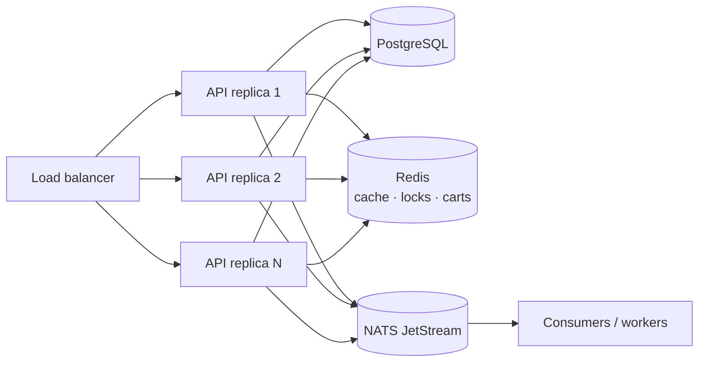

# OpenShop

A production-grade, **horizontally scalable** e-commerce storefront.

- **Backend** — Go · Gin · GORM · PostgreSQL · NATS (JetStream) · Redis
- **Frontend** — React 19 · TypeScript · Vite · TailwindCSS v4 · shadcn/ui

Every third-party integration is reached through a **port interface**, so the
business logic never depends on a concrete database, cache, broker, payment
gateway, object store or mail provider. Adapters are wired once, in the
composition root (`internal/bootstrap`).

---

## Table of contents

- [Why it scales horizontally](#why-it-scales-horizontally)
- [Architecture](#architecture)
- [Ports & adapters](#ports--adapters)
- [Directory layout](#directory-layout)
- [Quick start](#quick-start)
- [Configuration](#configuration)
- [API reference](#api-reference)
- [Testing](#testing)
- [Design decisions](#design-decisions)

---

## Why it scales horizontally

Nothing that matters lives in a single process. You can run `N` API replicas
behind a load balancer and they will behave as one system.

| Concern | Mechanism |
| --- | --- |
| **Authentication** | Stateless JWTs verified locally by any replica; refresh tokens and a logout deny-list live in shared Redis. |
| **Carts** | Stored in Redis, not process memory, so any replica serves any user. |
| **Cache** | A single shared Redis cache; invalidations are visible to all replicas instantly. |
| **Checkout** | A per-user **distributed lock** (`Redis SET NX` with owner token) prevents duplicate submissions across replicas. |
| **Inventory** | Atomic compare-and-set (`UPDATE ... WHERE stock >= ?`) inside a DB transaction; overselling is impossible under concurrency. |
| **Events** | NATS JetStream with **durable queue groups** — adding replicas adds throughput, and each event is handled once per group. |
| **Scheduled jobs** | The order-expiry sweeper takes a Redis **leader lock**, so only one replica sweeps per tick. If it dies, the lock expires and another takes over. |
| **Readiness** | `/readyz` probes PostgreSQL, Redis and NATS so the load balancer can drain unhealthy replicas. |
| **Graceful shutdown** | In-flight requests drain, workers stop, and connections close cleanly on `SIGTERM`. |



---

## Architecture

OpenShop uses **hexagonal (ports & adapters) architecture**.

```
              ┌─────────────────────────────────────────────┐
 HTTP (Gin) → │  service (business logic, depends on ports) │ → port interfaces
              └─────────────────────────────────────────────┘
                                   ▲
                                   │ implemented by
              ┌────────────────────┴────────────────────────┐
              │  adapter: postgres · redis · nats · payment │
              │           storage · mail · sms · security   │
              └─────────────────────────────────────────────┘
```

- `internal/domain` — entities and business rules. Imports **nothing** external.
- `internal/port` — interfaces for every external capability.
- `internal/service` — use cases. Depends only on `domain` + `port`.
- `internal/adapter/*` — concrete implementations (the only place GORM, Redis,
  NATS, AWS SDK, bcrypt, JWT, etc. are imported).
- `internal/http` — Gin transport; translates HTTP ⇄ service.
- `internal/bootstrap` — composition root; the single place adapters are chosen.

This is why the entire service layer is tested with **zero infrastructure**
running (see [Testing](#testing)).

---

## Ports & adapters

| Port (`internal/port`) | Production adapter | Local / dev adapter |
| --- | --- | --- |
| `UserRepository`, `ProductRepository`, `OrderRepository`, `PaymentRepository`, `CategoryRepository` | GORM + PostgreSQL | in-memory fakes (tests) |
| `CartRepository` | Redis | in-memory fake (tests) |
| `Cache` | Redis | in-memory fake (tests) |
| `Locker` | Redis (`SET NX` + Lua release) | in-memory fake (tests) |
| `EventBus` | NATS JetStream | in-memory fake (tests) |
| `PaymentProvider` / `PaymentRegistry` | `mock` (sandbox) | plug in Stripe/Alipay/WeChat |
| `ObjectStorage` | S3 / MinIO (`s3`) | local disk (`local`) |
| `Mailer` | SMTP | log |
| `SMS` | Aliyun (stub) | log |
| `PasswordHasher` | bcrypt | fake (tests) |
| `TokenIssuer` | JWT (HS256) | fake (tests) |
| `IDGenerator` | UUID v4 | sequential (tests) |
| `Clock` | system clock | fixed (tests) |
| `TxManager` | GORM transaction | pass-through (tests) |
| `Logger`, `Metrics` | `log/slog`, no-op | — |

Swap an adapter by changing one line in `internal/bootstrap/app.go`.

---

## Directory layout

```
openshop/
├── backend/
│   ├── cmd/
│   │   ├── server/         # API + workers
│   │   ├── migrate/        # versioned SQL migrations (advisory-locked)
│   │   └── seed/           # demo admin, categories, products
│   ├── internal/
│   │   ├── domain/         # entities, business rules, errors
│   │   ├── port/           # interfaces (the dependency boundary)
│   │   ├── service/        # use cases + tests with fakes
│   │   ├── adapter/        # postgres, redis, nats, payment, storage, mail, sms, security, logger
│   │   ├── http/           # router, middleware, handlers, response
│   │   ├── worker/         # event consumers + order sweeper
│   │   ├── config/         # 12-factor env configuration
│   │   └── bootstrap/      # composition root
│   └── migrations/         # *.sql
├── frontend/
│   └── src/
│       ├── components/ui/  # shadcn/ui primitives
│       ├── components/     # app components (header, product card, …)
│       ├── pages/          # routes
│       ├── hooks/          # react-query data hooks
│       └── lib/            # api client, auth context, types, formatting
├── scripts/dev-setup.sh    # local Postgres/Redis/NATS bootstrap
├── docker-compose.yml
└── Makefile
```

---

## Quick start

### Option A — Docker Compose (everything)

```bash
docker compose up --build -d
docker compose run --rm migrate      # apply migrations
docker compose run --rm seed         # optional demo data (profile: seed)
```

- Storefront: <http://localhost:5173>
- API: <http://localhost:8080/api/v1>
- NATS monitoring: <http://localhost:8222>

Run several API replicas to see horizontal scaling:

```bash
docker compose up --scale backend=3
```

### Option B — Local toolchain

```bash
# 1. Prepare Postgres, Redis and NATS (idempotent)
./scripts/dev-setup.sh

# 2. Backend
cd backend
cp .env.example .env
go run ./cmd/migrate -dir migrations
go run ./cmd/seed
go run ./cmd/server

# 3. Frontend (separate terminal)
cd frontend
npm install
npm run dev
```

Demo credentials created by the seed: `admin@openshop.local` / `admin12345`.

### Make targets

```bash
make help        # list everything
make infra       # start postgres/redis/nats via docker
make migrate     # apply migrations
make seed        # insert demo data
make run         # run the API
make test        # go test ./... -race
make fe-dev      # frontend dev server
```

---

## Configuration

All configuration is environment-based (see `backend/.env.example`). Highlights:

| Variable | Default | Purpose |
| --- | --- | --- |
| `POSTGRES_DSN` | local DSN | PostgreSQL connection string |
| `REDIS_ADDR` | `localhost:6379` | shared cache / locks / carts |
| `NATS_URL` | `nats://localhost:4222` | event bus (JetStream required) |
| `JWT_SECRET` | dev value | **must** be set in production |
| `ORDER_TTL` | `30m` | unpaid-order expiry window |
| `PAYMENT_PROVIDER` | `mock` | active payment gateway |
| `STORAGE_DRIVER` | `local` | `local` or `s3` |
| `WORKER_ENABLED` | `true` | run event consumers + sweeper |
| `HTTP_CORS_ORIGINS` | `http://localhost:5173` | allowed SPA origins |

---

## API reference

Base path: `/api/v1`. Responses are enveloped as `{ "data": … }` or
`{ "error": { "code", "message" } }`; list endpoints also return `meta`.

### Auth

| Method | Path | Auth | Description |
| --- | --- | --- | --- |
| `POST` | `/auth/register` | — | Create an account |
| `POST` | `/auth/login` | — | Sign in (email or phone) |
| `POST` | `/auth/refresh` | — | Rotate the refresh token |
| `POST` | `/auth/logout` | ✔ | Revoke the current tokens |
| `GET` | `/auth/me` | ✔ | Current profile |

### Catalog

| Method | Path | Auth | Description |
| --- | --- | --- | --- |
| `GET` | `/categories` | — | List categories |
| `GET` | `/products` | — | List/search (`categoryId`, `keyword`, `sort`, `page`, `pageSize`) |
| `GET` | `/products/:id` | — | Product detail (cached) |

### Cart

| Method | Path | Auth | Description |
| --- | --- | --- | --- |
| `GET` | `/cart` | ✔ | Get the cart |
| `POST` | `/cart/items` | ✔ | Add an item |
| `PATCH` | `/cart/items/:productId` | ✔ | Set quantity |
| `DELETE` | `/cart/items/:productId` | ✔ | Remove an item |
| `DELETE` | `/cart` | ✔ | Clear the cart |

### Orders & payments

| Method | Path | Auth | Description |
| --- | --- | --- | --- |
| `POST` | `/orders` | ✔ | Checkout (reserves stock atomically) |
| `GET` | `/orders` | ✔ | List orders (admins see all) |
| `GET` | `/orders/:id` | ✔ | Order detail |
| `POST` | `/orders/:id/cancel` | ✔ | Cancel & release stock |
| `POST` | `/payments` | ✔ | Create a payment session |
| `POST` | `/payments/simulate` | ✔ | Sandbox: confirm a mock payment |
| `POST` | `/webhooks/payments/:provider` | — | Provider callback (signature-verified) |

### Admin

| Method | Path | Description |
| --- | --- | --- |
| `POST` | `/admin/categories` | Create a category |
| `POST` | `/admin/products` | Create a product |
| `PATCH` | `/admin/products/:id` | Update a product |
| `POST` | `/admin/uploads` | Upload an image (multipart) |
| `GET` | `/admin/orders` | List all orders |

### Ops

`GET /healthz` (liveness) · `GET /readyz` (dependency readiness) ·
`GET /api/v1/version`

### Example: checkout

```bash
TOKEN=$(curl -s localhost:8080/api/v1/auth/login \
  -H 'Content-Type: application/json' \
  -d '{"identifier":"admin@openshop.local","password":"admin12345"}' \
  | jq -r .data.accessToken)

curl -s localhost:8080/api/v1/cart/items \
  -H "Authorization: Bearer $TOKEN" -H 'Content-Type: application/json' \
  -d '{"productId":"<id>","quantity":2}'

curl -s -X POST localhost:8080/api/v1/orders -H "Authorization: Bearer $TOKEN"
```

---

## Testing

```bash
cd backend && go test ./... -race
```

The service tests use in-memory fakes for every port
(`internal/service/fakes_test.go`), so they run in milliseconds with **no
Postgres, Redis or NATS**. Covered scenarios include:

- checkout reserves stock, clears the cart and emits `order.created`
- insufficient stock is rejected without side effects
- cancellation restores stock and is not idempotent twice
- `MarkPaid` is idempotent (duplicate webhooks are no-ops)
- expired orders are listed for the sweeper
- registration/login/refresh and refresh-token rotation

---

## Design decisions

- **Money as integers.** Prices are stored in minor units (`price_cents`) to
  avoid floating-point drift.
- **UUID primary keys.** Any replica can generate ids without a central
  sequence, which removes a scaling bottleneck and simplifies merges.
- **Versioned migrations with an advisory lock.** `make migrate` is safe to run
  from every replica at deploy time.
- **Sandbox payments.** The `mock` provider implements an extra
  `SandboxProvider` port so the full checkout can be exercised locally; real
  providers simply don't implement it, and `POST /payments/simulate` rejects
  them.
- **Error envelopes.** Domain sentinel errors are mapped to HTTP status codes in
  one place (`internal/http/response`), keeping handlers thin.
- **At-least-once events.** Consumers are idempotent and publishing never fails
  a request; a failed publish is logged and retried by the broker.
