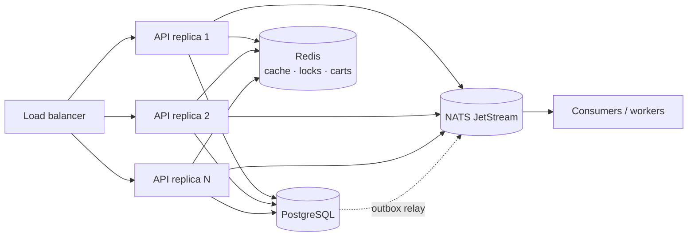

# OpenShop

A production-grade, **horizontally scalable** e-commerce storefront.

- **Backend** — Go · Gin · GORM · PostgreSQL · NATS (JetStream) · Redis
- **Frontend** — React 19 · TypeScript · Vite · TailwindCSS v4 · shadcn/ui

Every third-party integration is reached through a **port interface**, so the
business logic never depends on a concrete database, cache, broker, payment
gateway, object store or mail provider. Adapters are wired once, in the
composition root (`internal/bootstrap`).

---

## Table of contents

- [Why it scales horizontally](#why-it-scales-horizontally)
- [Architecture](#architecture)
- [Ports & adapters](#ports--adapters)
- [Directory layout](#directory-layout)
- [Quick start](#quick-start)
- [Configuration](#configuration)
- [API reference](#api-reference)
- [Testing](#testing)
- [Design decisions](#design-decisions)

---

## Why it scales horizontally

Nothing that matters lives in a single process. You can run `N` API replicas
behind a load balancer and they will behave as one system.

| Concern | Mechanism |
| --- | --- |
| **Authentication** | Stateless JWTs verified locally by any replica; refresh tokens and a logout deny-list live in shared Redis. |
| **Carts** | Stored in Redis, not process memory, so any replica serves any user. |
| **Cache** | A single shared Redis cache; invalidations are visible to all replicas instantly. |
| **Checkout** | A per-user **distributed lock** (`Redis SET NX` with owner token) prevents duplicate submissions across replicas. |
| **Inventory** | Atomic compare-and-set (`UPDATE ... WHERE stock >= ?`) inside a DB transaction; overselling is impossible under concurrency. |
| **Events** | NATS JetStream with **durable queue groups** — adding replicas adds throughput, and each event is handled once per group. |
| **Reliable events** | A **transactional outbox**: events are committed in the same DB transaction as the state change, then a relay publishes them (SKIP LOCKED, at-least-once). A crash can never lose an event. |
| **Safe retries** | `Idempotency-Key` on checkout/payment: the first response is cached and replayed, so network retries never create duplicate orders. |
| **Coupon limits** | Global usage caps enforced by an atomic conditional `UPDATE … WHERE used_count < usage_limit`, so the cap holds across replicas. |
| **Scheduled jobs** | The order-expiry sweeper takes a Redis **leader lock**, so only one replica sweeps per tick. If it dies, the lock expires and another takes over. |
| **Readiness** | `/readyz` probes PostgreSQL, Redis and NATS so the load balancer can drain unhealthy replicas. |
| **Graceful shutdown** | In-flight requests drain, workers stop, and connections close cleanly on `SIGTERM`. |



### Reliability: the transactional outbox

Publishing to a broker *after* committing a database write has a classic failure
window: the process can crash in between, silently losing the event. OpenShop
avoids this with the **transactional outbox**:

1. Checkout writes the order **and** an `outbox_events` row in one transaction.
2. A relay worker leases pending rows with `SELECT … FOR UPDATE SKIP LOCKED`,
   publishes them to NATS, then marks them published.
3. Failed publishes are retried with exponential backoff; a lease that expires
   (crashed relay) is reclaimed automatically.

Any number of relays can run concurrently — `SKIP LOCKED` guarantees each
message is leased by exactly one — so event delivery scales with the fleet.

---

## Architecture

OpenShop uses **hexagonal (ports & adapters) architecture**.

```
              ┌─────────────────────────────────────────────┐
 HTTP (Gin) → │  service (business logic, depends on ports) │ → port interfaces
              └─────────────────────────────────────────────┘
                                   ▲
                                   │ implemented by
              ┌────────────────────┴────────────────────────┐
              │  adapter: postgres · redis · nats · payment │
              │           storage · mail · sms · security   │
              └─────────────────────────────────────────────┘
```

- `internal/domain` — entities and business rules. Imports **nothing** external.
- `internal/port` — interfaces for every external capability.
- `internal/service` — use cases. Depends only on `domain` + `port`.
- `internal/adapter/*` — concrete implementations (the only place GORM, Redis,
  NATS, AWS SDK, bcrypt, JWT, etc. are imported).
- `internal/http` — Gin transport; translates HTTP ⇄ service.
- `internal/bootstrap` — composition root; the single place adapters are chosen.

This is why the entire service layer is tested with **zero infrastructure**
running (see [Testing](#testing)).

---

## Ports & adapters

| Port (`internal/port`) | Production adapter | Local / dev adapter |
| --- | --- | --- |
| `UserRepository`, `ProductRepository`, `OrderRepository`, `PaymentRepository`, `CategoryRepository` | GORM + PostgreSQL | in-memory fakes (tests) |
| `CartRepository` | Redis | in-memory fake (tests) |
| `CouponRepository`, `ReviewRepository` | GORM + PostgreSQL | in-memory fakes (tests) |
| `VariantRepository` | GORM + PostgreSQL (SKU inventory) | in-memory fake (tests) |
| `Cache` | Redis | in-memory fake (tests) |
| `Locker` | Redis (`SET NX` + Lua release) | in-memory fake (tests) |
| `EventBus` | NATS JetStream | in-memory fake (tests) |
| `Outbox` | PostgreSQL (`SKIP LOCKED` relay) | in-memory fake (tests) |
| `PaymentProvider` / `PaymentRegistry` | `mock` (sandbox) | plug in Stripe/Alipay/WeChat |
| `ObjectStorage` | S3 / MinIO (`s3`) | local disk (`local`) |
| `Mailer` | SMTP | log |
| `SMS` | Aliyun (stub) | log |
| `PasswordHasher` | bcrypt | fake (tests) |
| `TokenIssuer` | JWT (HS256) | fake (tests) |
| `IDGenerator` | UUID v4 | sequential (tests) |
| `Clock` | system clock | fixed (tests) |
| `TxManager` | GORM transaction | pass-through (tests) |
| `Logger`, `Metrics` | `log/slog`, Prometheus (`/metrics`) | no-op |

Swap an adapter by changing one line in `internal/bootstrap/app.go`.

---

## Directory layout

```
openshop/
├── backend/
│   ├── cmd/
│   │   ├── server/         # API + workers
│   │   ├── migrate/        # versioned SQL migrations (advisory-locked)
│   │   └── seed/           # demo admin, categories, products
│   ├── internal/
│   │   ├── domain/         # entities, business rules, errors
│   │   ├── port/           # interfaces (the dependency boundary)
│   │   ├── service/        # use cases + tests with fakes
│   │   ├── adapter/        # postgres, redis, nats, payment, storage, mail, sms, security, logger, metrics
│   │   ├── http/           # router, middleware, handlers, response, docs (OpenAPI)
│   │   ├── worker/         # event consumers, order sweeper, outbox relay
│   │   ├── config/         # 12-factor env configuration
│   │   └── bootstrap/      # composition root
│   └── migrations/         # *.sql (core, outbox, coupons, reviews, search, tracing, variants)
├── frontend/
│   └── src/
│       ├── components/ui/  # shadcn/ui primitives
│       ├── components/     # app components (header, product card, admin form, …)
│       ├── pages/          # routes (incl. pages/admin)
│       ├── hooks/          # react-query data hooks
│       └── lib/            # api client, auth context, types, formatting
├── deploy/k8s/             # namespace/config, infra, backend (HPA+PDB), frontend+ingress
├── scripts/                # dev-setup.sh, smoke.sh, loadtest.js (k6)
├── .github/workflows/      # CI (backend, frontend, docker)
├── docker-compose.yml
└── Makefile
```

---

## Quick start

### Option A — Docker Compose (everything)

```bash
docker compose up --build -d
docker compose run --rm migrate      # apply migrations
docker compose run --rm seed         # optional demo data (profile: seed)
```

- Storefront: <http://localhost:5173>
- API: <http://localhost:8080/api/v1>
- NATS monitoring: <http://localhost:8222>

Run several API replicas to see horizontal scaling:

```bash
docker compose up --scale backend=3
```

### Option B — Local toolchain

```bash
# 1. Prepare Postgres, Redis and NATS (idempotent)
./scripts/dev-setup.sh

# 2. Backend
cd backend
cp .env.example .env
go run ./cmd/migrate -dir migrations
go run ./cmd/seed
go run ./cmd/server

# 3. Frontend (separate terminal)
cd frontend
npm install
npm run dev
```

Demo credentials created by the seed: `admin@openshop.local` / `admin12345`.

### Make targets

```bash
make help        # list everything
make infra       # start postgres/redis/nats via docker
make migrate     # apply migrations
make seed        # insert demo data
make run         # run the API
make test        # go test ./... -race
make fe-dev      # frontend dev server
```

---

## Configuration

All configuration is environment-based (see `backend/.env.example`). Highlights:

| Variable | Default | Purpose |
| --- | --- | --- |
| `POSTGRES_DSN` | local DSN | PostgreSQL connection string |
| `REDIS_ADDR` | `localhost:6379` | shared cache / locks / carts |
| `NATS_URL` | `nats://localhost:4222` | event bus (JetStream required) |
| `JWT_SECRET` | dev value | **must** be set in production |
| `ORDER_TTL` | `30m` | unpaid-order expiry window |
| `PAYMENT_PROVIDER` | `mock` | active payment gateway |
| `STORAGE_DRIVER` | `local` | `local` or `s3` |
| `WORKER_ENABLED` | `true` | run event consumers + sweeper |
| `HTTP_CORS_ORIGINS` | `http://localhost:5173` | allowed SPA origins |

---

## API reference

Base path: `/api/v1`. Responses are enveloped as `{ "data": … }` or
`{ "error": { "code", "message" } }`; list endpoints also return `meta`.

- Interactive docs: `GET /docs`
- OpenAPI document: `GET /api/v1/openapi.yaml`
- Prometheus metrics: `GET /metrics`

Send `Idempotency-Key: <uuid>` on `POST /orders` and `POST /payments` to make
retries safe.

### Auth

| Method | Path | Auth | Description |
| --- | --- | --- | --- |
| `POST` | `/auth/register` | — | Create an account |
| `POST` | `/auth/login` | — | Sign in (email or phone) |
| `POST` | `/auth/refresh` | — | Rotate the refresh token |
| `POST` | `/auth/logout` | ✔ | Revoke the current tokens |
| `GET` | `/auth/me` | ✔ | Current profile |

### Catalog

| Method | Path | Auth | Description |
| --- | --- | --- | --- |
| `GET` | `/categories` | — | List categories |
| `GET` | `/products` | — | List/search (`categoryId`, `keyword`, `sort`, `page`, `pageSize`) |
| `GET` | `/products/:id` | — | Product detail (cached) |

### Cart

| Method | Path | Auth | Description |
| --- | --- | --- | --- |
| `GET` | `/cart` | ✔ | Get the cart |
| `POST` | `/cart/items` | ✔ | Add an item |
| `PATCH` | `/cart/items/:productId` | ✔ | Set quantity |
| `DELETE` | `/cart/items/:productId` | ✔ | Remove an item |
| `DELETE` | `/cart` | ✔ | Clear the cart |

### Reviews & coupons

| Method | Path | Auth | Description |
| --- | --- | --- | --- |
| `GET` | `/products/:id/reviews` | — | List a product's reviews |
| `POST` | `/products/:id/reviews` | ✔ | Create a review (one per user) |
| `PATCH` | `/reviews/:id` | ✔ | Update your review |
| `DELETE` | `/reviews/:id` | ✔ | Delete a review (owner or admin) |
| `POST` | `/coupons/preview` | ✔ | Validate a coupon and preview the discount |

### Orders & payments

| Method | Path | Auth | Description |
| --- | --- | --- | --- |
| `POST` | `/orders` | ✔ | Checkout (reserves stock atomically) |
| `GET` | `/orders` | ✔ | List orders (admins see all) |
| `GET` | `/orders/:id` | ✔ | Order detail |
| `POST` | `/orders/:id/cancel` | ✔ | Cancel & release stock |
| `POST` | `/orders/:id/complete` | ✔ | Confirm receipt of a shipped order |
| `GET` | `/addresses` | ✔ | List shipping addresses |
| `POST` | `/addresses` | ✔ | Create an address |
| `PATCH` | `/addresses/:id` | ✔ | Update an address |
| `DELETE` | `/addresses/:id` | ✔ | Delete an address |
| `POST` | `/addresses/:id/default` | ✔ | Set the default address |
| `POST` | `/payments` | ✔ | Create a payment session |
| `POST` | `/payments/simulate` | ✔ | Sandbox: confirm a mock payment |
| `POST` | `/webhooks/payments/:provider` | — | Provider callback (signature-verified) |

### Admin

| Method | Path | Description |
| --- | --- | --- |
| `POST` | `/admin/categories` | Create a category |
| `POST` | `/admin/products` | Create a product |
| `PATCH` | `/admin/products/:id` | Update a product |
| `POST` | `/admin/uploads` | Upload an image (multipart) |
| `GET` | `/admin/orders` | List all orders |
| `POST` | `/admin/orders/:id/refund` | Refund a paid order (restores stock) |
| `POST` | `/admin/orders/:id/ship` | Mark a paid order shipped (tracking number) |
| `POST` | `/admin/orders/:id/complete` | Mark a shipped order completed |
| `GET` | `/admin/coupons` | List coupons |
| `POST` | `/admin/coupons` | Create a coupon |
| `GET` | `/admin/products/:id/variants` | List a product's variants |
| `POST` | `/admin/products/:id/variants` | Create a variant (SKU) |
| `PATCH` | `/admin/variants/:id` | Update a variant |

### Ops

`GET /healthz` (liveness) · `GET /readyz` (dependency readiness) ·
`GET /api/v1/version`

### Example: checkout

```bash
TOKEN=$(curl -s localhost:8080/api/v1/auth/login \
  -H 'Content-Type: application/json' \
  -d '{"identifier":"admin@openshop.local","password":"admin12345"}' \
  | jq -r .data.accessToken)

curl -s localhost:8080/api/v1/cart/items \
  -H "Authorization: Bearer $TOKEN" -H 'Content-Type: application/json' \
  -d '{"productId":"<id>","quantity":2}'

curl -s -X POST localhost:8080/api/v1/orders -H "Authorization: Bearer $TOKEN"
```

---

## Testing

The service layer depends only on ports, so it is tested with **in-memory fakes
and no infrastructure**:

```bash
cd backend && go test ./... -race
```

Covered scenarios include:

- checkout reserves stock, clears the cart and enqueues `order.created`
- insufficient stock is rejected without side effects
- cancellation restores stock and cannot double-refund it
- `MarkPaid` is idempotent (duplicate webhooks are no-ops)
- expired orders are listed for the sweeper
- registration/login/refresh and **refresh-token theft detection**
- the outbox relay publishes, retries and caps backoff

### Integration tests (real PostgreSQL)

Adapter behaviour that depends on the database (e.g. `SKIP LOCKED` leasing) is
covered by integration tests that run when a DSN is provided:

```bash
cd backend
TEST_DATABASE_URL='host=localhost user=openshop password=openshop dbname=openshop sslmode=disable' \
  go test ./internal/adapter/postgres/ -run TestOutboxClaimSemantics
```

### End-to-end smoke test

Against a running API:

```bash
API_BASE=http://localhost:8080/api/v1 ./scripts/smoke.sh
```

It verifies login, catalog, stock reservation, **idempotent replay**, payment
and the resulting paid order.

### Load test

```bash
k6 run scripts/loadtest.js            # browse + shop scenarios, thresholds enforced
```

---

## Observability

Every process exposes Prometheus metrics at `GET /metrics`:

| Metric | Type | Meaning |
| --- | --- | --- |
| `openshop_http_requests_total` | counter | requests by method, route, status |
| `openshop_http_request_duration_seconds` | histogram | request latency |
| `openshop_orders_created_total` | counter | orders created by currency |
| `openshop_orders_paid_total` | counter | orders paid |
| `openshop_payments_succeeded_total` | counter | successful payments by provider |
| `openshop_payments_refunded_total` | counter | refunded payments by provider |
| `openshop_orders_refunded_total` | counter | refunded orders |
| `openshop_outbox_published_total` | counter | events relayed by subject |
| `openshop_outbox_publish_failures_total` | counter | relay failures (retried) |

Logging is structured (`log/slog`, JSON in production) with a per-request
correlation id propagated from `X-Request-Id`. The `Metrics` and `Logger` ports
keep both swappable and no-op in tests.

### Distributed tracing

Tracing is behind the `port.Tracer` port with an OpenTelemetry adapter. When
`OTEL_EXPORTER_OTLP_ENDPOINT` is set, spans are exported over OTLP/HTTP;
otherwise a no-op tracer is used, so the binary carries no runtime vendor
dependency. Trace context is propagated with W3C `traceparent`:

- the HTTP middleware continues an inbound trace (or starts one),
- checkout injects the `traceparent` into the outbox event,
- the relay extracts it when publishing, and consumers extract it again when
  handling — so **checkout → outbox → relay → consumer is a single trace**,
  including the asynchronous hop.

```bash
# point at any OTLP collector (Jaeger, Tempo, Grafana Agent, …)
OTEL_EXPORTER_OTLP_ENDPOINT=localhost:4318 OTEL_INSECURE=true go run ./cmd/server
```

## Deployment

### Kubernetes

`deploy/k8s/` contains a runnable manifest set:

- `00-namespace-config.yaml` — namespace, ConfigMap, Secret
- `10-infra.yaml` — PostgreSQL / Redis / NATS StatefulSets (swap for managed services in production)
- `20-backend.yaml` — Deployment (3 replicas, rolling update, anti-affinity,
  topology spread), readiness/liveness probes, **HPA** (3→20 on CPU/memory), **PDB**,
  and an **init container** that runs migrations (safe on every pod via the advisory lock)
- `30-frontend.yaml` — Deployment, Service and Ingress

```bash
kubectl apply -f deploy/k8s/
kubectl -n openshop rollout status deploy/openshop-backend
kubectl -n openshop scale deploy/openshop-backend --replicas=6
```

### CI

`.github/workflows/ci.yml` runs on every push/PR:

- **backend**: `gofmt` check, `go vet`, `go build`, `go test -race` with real
  PostgreSQL + Redis services (integration tests included), coverage summary
- **frontend**: `npm ci`, type-check, production build
- **docker**: builds both images

## Design decisions

- **Money as integers.** Prices are stored in minor units (`price_cents`) to
  avoid floating-point drift.
- **UUID primary keys.** Any replica can generate ids without a central
  sequence, which removes a scaling bottleneck and simplifies merges.
- **Versioned migrations with an advisory lock.** `make migrate` is safe to run
  from every replica at deploy time.
- **Sandbox payments.** The `mock` provider implements an extra
  `SandboxProvider` port so the full checkout can be exercised locally; real
  providers simply don't implement it, and `POST /payments/simulate` rejects
  them.
- **Error envelopes.** Domain sentinel errors are mapped to HTTP status codes in
  one place (`internal/http/response`), keeping handlers thin.
- **At-least-once, never lost.** Events go through the transactional outbox, so
  they are committed with the business write and relayed with retries; consumers
  are idempotent.
- **Idempotent writes.** Checkout and payment accept an `Idempotency-Key`; the
  first outcome is cached and replayed, and concurrent duplicates get `409`.
- **Read-your-writes for stock.** Checkout evicts the product cache
  synchronously (and the event consumer does so again as a safety net), so the
  catalog reflects reservations immediately.
- **Least privilege in the catalog.** Public product listings are forced to
  `published`; only admins can list drafts via `/admin/products`.
- **Discounts are integers too.** Percent coupons use integer math and caps so
  rounding never produces fractional money; the discount can never exceed the
  subtotal.
- **Indexed search with a fallback.** Products carry a generated `tsvector`
  column with a GIN index; queries also fall back to a substring match so CJK
  and partial words still work.
- **One checkout path for simple and variant products.** When a product has
  variants, inventory and price live on the variant; otherwise on the product.
  Checkout resolves the purchasable unit, so both share the same atomic
  reservation, cancellation and refund logic. Cart lines are keyed by
  `(product, variant)`.
- **Addresses are snapshotted.** Checkout copies the chosen address onto the
  order, so editing the address book never rewrites order history.
- **Explicit fulfilment state machine.** `pending_payment → paid → shipped →
  completed`, with `cancelled`/`refunded` as terminal branches. Every transition
  is idempotent, lock-protected and emits an event.
