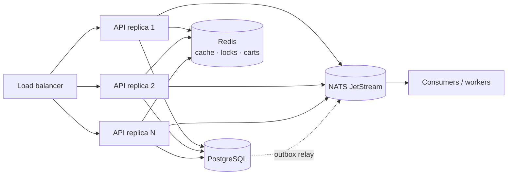

# OpenShop

A production-grade, **horizontally scalable** e-commerce storefront.

- **Backend** — Go · Gin · GORM · PostgreSQL · NATS (JetStream) · Redis
- **Two binaries** — `openshop` (storefront + public API) and `openshop-ops`
  (admin console + ops API), **isolated at the binary level** so the admin
  surface can be deployed on an internal network. Both embed their SPA.
- **Frontends** — React 19 · TypeScript · Vite · TailwindCSS v4 · shadcn/ui,
  as two SPAs sharing one `lib/` (`front` storefront, `ops` admin console).
  Package management is pnpm (workspace). Both are internationalised (English
  and Chinese) via a shared, dependency-free `lib/i18n` with a language switcher.

Every third-party integration is reached through a **port interface**, so the
business logic never depends on a concrete database, cache, broker, payment
gateway, object store or mail provider. Adapters are wired once, in the
composition root (`internal/bootstrap`).

## What's included

**Storefront** — catalog with categories, product variants/SKUs, image gallery,
full-text search, reviews with ratings, cart, coupons, shipping methods and tax,
saved addresses, checkout, order tracking and self-service cancellation.

**Operations** — a routed admin console (its own `openshop-ops` binary, built for
an internal network) with a sidebar: merchant
dashboard (revenue, order counts, low stock), product/variant management with
image upload, order fulfilment (ship with tracking, complete, refund), coupon
and shipping-method/zone management, exchange rates, an audit trail (including
failed logins), and review moderation.

**Platform** — JWT auth with refresh rotation, theft detection, email
verification and password reset; per-IP and per-user sliding-window rate
limiting; payments
behind a provider port (sandbox included); guest checkout via an access token;
multi-currency settlement; transactional outbox for reliable events; idempotent
checkout; distributed locks; NATS queue-group consumers; Redis cache/locks/carts;
Prometheus metrics; OpenTelemetry tracing across the async boundary; versioned
migrations; SEO (robots/sitemap/JSON-LD); Docker Compose, Kubernetes manifests,
CI, a smoke test and a k6 load test.

**Delivery** — two self-contained binaries: `openshop` serves the public API and
the storefront SPA, `openshop-ops` serves the ops API and the admin console SPA
(meant for an internal network). GoReleaser publishes checksummed builds for
Linux/macOS/Windows to GitHub Releases, and a one-line install script downloads
the right build for the host.

---

## Table of contents

- [Why it scales horizontally](#why-it-scales-horizontally)
- [Architecture](#architecture)
- [Ports & adapters](#ports--adapters)
- [Directory layout](#directory-layout)
- [Quick start](#quick-start)
- [Configuration](#configuration)
- [API reference](#api-reference)
- [Testing](#testing)
- [Design decisions](#design-decisions)

---

## Why it scales horizontally

Nothing that matters lives in a single process. You can run `N` API replicas
behind a load balancer and they will behave as one system.

| Concern | Mechanism |
| --- | --- |
| **Authentication** | Stateless JWTs verified locally by any replica; refresh tokens and a logout deny-list live in shared Redis. |
| **Carts** | Stored in Redis, not process memory, so any replica serves any user. |
| **Cache** | A single shared Redis cache; invalidations are visible to all replicas instantly. |
| **Checkout** | A per-user **distributed lock** (`Redis SET NX` with owner token) prevents duplicate submissions across replicas. |
| **Inventory** | Atomic compare-and-set (`UPDATE ... WHERE stock >= ?`) inside a DB transaction; overselling is impossible under concurrency. |
| **Events** | NATS JetStream with **durable queue groups** — adding replicas adds throughput, and each event is handled once per group. |
| **Reliable events** | A **transactional outbox**: events are committed in the same DB transaction as the state change, then a relay publishes them (SKIP LOCKED, at-least-once). A crash can never lose an event. |
| **Safe retries** | `Idempotency-Key` on checkout/payment: the first response is cached and replayed, so network retries never create duplicate orders. |
| **Coupon limits** | Global usage caps enforced by an atomic conditional `UPDATE … WHERE used_count < usage_limit`, so the cap holds across replicas. |
| **Scheduled jobs** | The order-expiry sweeper takes a Redis **leader lock**, so only one replica sweeps per tick. If it dies, the lock expires and another takes over. |
| **Readiness** | `/readyz` probes PostgreSQL, Redis and NATS so the load balancer can drain unhealthy replicas. |
| **Graceful shutdown** | In-flight requests drain, workers stop, and connections close cleanly on `SIGTERM`. |



### Reliability: the transactional outbox

Publishing to a broker *after* committing a database write has a classic failure
window: the process can crash in between, silently losing the event. OpenShop
avoids this with the **transactional outbox**:

1. Checkout writes the order **and** an `outbox_events` row in one transaction.
2. A relay worker leases pending rows with `SELECT … FOR UPDATE SKIP LOCKED`,
   publishes them to NATS, then marks them published.
3. Failed publishes are retried with exponential backoff; a lease that expires
   (crashed relay) is reclaimed automatically.

Any number of relays can run concurrently — `SKIP LOCKED` guarantees each
message is leased by exactly one — so event delivery scales with the fleet.

---

## Architecture

OpenShop uses **hexagonal (ports & adapters) architecture**.

```
              ┌─────────────────────────────────────────────┐
 HTTP (Gin) → │  service (business logic, depends on ports) │ → port interfaces
              └─────────────────────────────────────────────┘
                                   ▲
                                   │ implemented by
              ┌────────────────────┴────────────────────────┐
              │  adapter: postgres · redis · nats · payment │
              │           storage · mail · sms · security   │
              └─────────────────────────────────────────────┘
```

- `internal/domain` — entities and business rules. Imports **nothing** external.
- `internal/port` — interfaces for every external capability.
- `internal/service` — use cases. Depends only on `domain` + `port`.
- `internal/adapter/*` — concrete implementations (the only place GORM, Redis,
  NATS, AWS SDK, bcrypt, JWT, etc. are imported).
- `internal/http` — Gin transport; translates HTTP ⇄ service.
- `internal/bootstrap` — composition root; the single place adapters are chosen.

This is why the entire service layer is tested with **zero infrastructure**
running (see [Testing](#testing)).

---

## Ports & adapters

| Port (`internal/port`) | Production adapter | Local / dev adapter |
| --- | --- | --- |
| `UserRepository`, `ProductRepository`, `OrderRepository`, `PaymentRepository`, `CategoryRepository` | GORM + PostgreSQL | in-memory fakes (tests) |
| `CartRepository` | Redis | in-memory fake (tests) |
| `CouponRepository`, `ReviewRepository` | GORM + PostgreSQL | in-memory fakes (tests) |
| `VariantRepository` | GORM + PostgreSQL (SKU inventory) | in-memory fake (tests) |
| `Cache` | Redis | in-memory fake (tests) |
| `Locker` | Redis (`SET NX` + Lua release) | in-memory fake (tests) |
| `EventBus` | NATS JetStream | in-memory fake (tests) |
| `Outbox` | PostgreSQL (`SKIP LOCKED` relay) | in-memory fake (tests) |
| `PaymentProvider` / `PaymentRegistry` | `mock` (sandbox) | plug in Stripe/Alipay/WeChat |
| `ObjectStorage` | S3 / MinIO (`s3`) | local disk (`local`) |
| `Mailer` | SMTP | log |
| `SMS` | Aliyun (stub) | log |
| `PasswordHasher` | bcrypt | fake (tests) |
| `TokenIssuer` | JWT (HS256) | fake (tests) |
| `IDGenerator` | UUID v4 | sequential (tests) |
| `Clock` | system clock | fixed (tests) |
| `TxManager` | GORM transaction | pass-through (tests) |
| `Logger`, `Metrics` | `log/slog`, Prometheus (`/metrics`) | no-op |

Swap an adapter by changing one line in `internal/bootstrap/app.go`.

---

## Directory layout

```
openshop/
├── backend/
│   ├── cmd/
│   │   ├── server/         # storefront binary: public API + storefront SPA + workers
│   │   ├── ops/            # ops binary: admin API + console SPA (no workers)
│   │   ├── migrate/        # versioned SQL migrations (advisory-locked)
│   │   └── seed/           # demo admin, categories, products
│   ├── internal/
│   │   ├── domain/         # entities, business rules, errors
│   │   ├── port/           # interfaces (the dependency boundary)
│   │   ├── service/        # use cases + tests with fakes
│   │   ├── adapter/        # postgres, redis, nats, payment, storage, mail, sms, security, logger, metrics
│   │   ├── http/
│   │   │   ├── front/      # storefront surface (routes + engine)
│   │   │   ├── ops/        # operations surface (routes + engine)
│   │   │   ├── handler/    # shared handlers used by both surfaces
│   │   │   ├── middleware/ # auth, rate limit, idempotency, tracing, …
│   │   │   ├── web/        # embedded front + ops SPAs
│   │   │   └── docs/       # OpenAPI document + Swagger UI
│   │   ├── worker/         # event consumers, order sweeper, outbox relay
│   │   ├── config/         # 12-factor env configuration
│   │   ├── version/        # build metadata injected by GoReleaser
│   │   └── bootstrap/      # composition root (surface injected by the command)
│   └── migrations/         # *.sql up + down/ (reversible)
├── lib/                    # shared frontend code: api client, auth, types, ui, hooks
├── front/                  # storefront SPA (Vite, built to front/dist)
├── ops/                    # admin console SPA (served at the root of the ops binary)
├── deploy/k8s/             # namespace/config, infra, backend (HPA+PDB), ops (internal), ingress
├── scripts/                # dev-setup.sh, embed-frontend.sh, install.sh, smoke.sh, loadtest.js
├── .github/workflows/      # CI (backend, frontends, docker) + release (GoReleaser)
├── .goreleaser.yaml        # release binaries for GitHub Releases
├── docker-compose.yml
└── Makefile
```

---

## Quick start

### Option 0 — Install the release binary (one line)

No Go or Node toolchain required; the binaries already embed both SPAs.

```bash
curl -fsSL https://raw.githubusercontent.com/holihur/openshop/main/scripts/install.sh | sh
```

The installer detects the OS/arch, verifies the SHA-256 checksum, installs
`openshop`, `openshop-ops`, `openshop-migrate` and `openshop-seed` (plus the SQL
migrations) and prints the next steps. Then point it at PostgreSQL/Redis/NATS,
migrate and run both binaries:

```bash
export POSTGRES_DSN='host=localhost port=5432 user=openshop password=openshop dbname=openshop sslmode=disable TimeZone=UTC'
export REDIS_ADDR='localhost:6379'
export NATS_URL='nats://localhost:4222'
export JWT_SECRET="$(head -c 32 /dev/urandom | base64)"
openshop-migrate -dir ~/.local/share/openshop/migrations
openshop                      # storefront + public API  -> http://localhost:8080/
OPS_ADDR=:8081 openshop-ops   # admin console (internal) -> http://localhost:8081/
```

### Option A — Docker Compose (everything)

One image contains both binaries and the embedded SPAs; Compose runs them as two
services.

```bash
docker compose up --build -d          # builds the image, migrates, starts storefront + ops
docker compose run --rm seed          # optional demo data (profile: seed)
```

- Storefront (public): <http://localhost:8080/>
- Ops console (internal): <http://localhost:8081/>
- API: <http://localhost:8080/api/v1> · docs <http://localhost:8080/docs>
- NATS monitoring: <http://localhost:8222>

A root `.env` (generated by `install.sh`, or copy `backend/.env.example`) can set
`POSTGRES_PASSWORD`, `JWT_SECRET`, `HTTP_PORT`, `OPS_PORT`, `APP_CURRENCY`, …

Run several storefront replicas to see horizontal scaling:

```bash
docker compose up --scale backend=3
```

### Option B — Local toolchain

```bash
# 1. Prepare Postgres, Redis and NATS (idempotent)
./scripts/dev-setup.sh

# 2. Backend binaries
cd backend
cp .env.example .env
go run ./cmd/migrate -dir migrations
# Roll back the last N migrations (paired *.down.sql files live in migrations/down/):
# go run ./cmd/migrate -dir migrations -down 1
go run ./cmd/seed
go run ./cmd/server          # storefront on :8080
go run ./cmd/ops             # ops console on :8081

# 3. Frontends (separate terminals, optional in dev)
pnpm install
pnpm --filter @openshop/front dev   # storefront on :5173 (proxies to :8080)
pnpm --filter @openshop/ops dev     # admin console on :5174 (proxies to :8081)
```

To serve the built SPAs from the Go binaries locally, run `make fe-build` before
running them; it builds `front`/`ops` and copies them into the module.

Demo credentials created by the seed:

- Storefront (customers): `customer@openshop.local` / `customer12345`
- Ops console (superuser): `admin@openshop.local` / `admin12345`
- Ops console (narrow RBAC roles):
  - `support@openshop.local` / `support12345` — orders, returns, reviews
  - `catalog@openshop.local` / `catalog12345` — products, shipping, currency
  - `finance@openshop.local` / `finance12345` — refunds, currency, audit

### Make targets

```bash
make help        # list everything
make infra       # start postgres/redis/nats via docker
make migrate     # apply migrations
make migrate-down N=1   # revert the last migration
make seed        # insert demo data
make run         # run the storefront binary
make run-ops     # run the ops binary on :8081
make test        # go test ./... -race
make fe-build    # build front + ops and embed them into the binaries
make fe-dev      # storefront dev server
make ops-dev     # admin console dev server
make e2e         # Playwright browser tests (both binaries)
make release     # local GoReleaser snapshot build
```

---

## Configuration

All configuration is environment-based (see `backend/.env.example`). Highlights:

| Variable | Default | Purpose |
| --- | --- | --- |
| `POSTGRES_DSN` | local DSN | PostgreSQL connection string |
| `REDIS_ADDR` | `localhost:6379` | shared cache / locks / carts |
| `NATS_URL` | `nats://localhost:4222` | event bus (JetStream required) |
| `JWT_SECRET` | dev value | **must** be set in production |
| `ORDER_TTL` | `30m` | unpaid-order expiry window |
| `PAYMENT_PROVIDER` | `mock` | active payment gateway |
| `STORAGE_DRIVER` | `local` | `local` or `s3` |
| `WORKER_ENABLED` | `true` | run event consumers + sweeper (storefront binary) |
| `HTTP_CORS_ORIGINS` | `http://localhost:5173,http://localhost:5174` | allowed SPA dev origins |
| `OPS_ADDR` | `:8081` | listen address of the `openshop-ops` binary (internal) |

---

## API reference

Base path: `/api/v1`. Responses are enveloped as `{ "data": … }` or
`{ "error": { "code", "message" } }`; list endpoints also return `meta`.

The API is split across the two binaries:

- **Storefront** (`openshop`, public) — catalog, cart, checkout, auth, reviews,
  addresses, wishlist, guest orders, SEO. Sections below up to *Orders & payments*.
- **Ops** (`openshop-ops`, internal) — everything under `/api/v1/ops` plus the
  auth/category/currency reads the console needs.

- Interactive docs: `GET /docs`
- OpenAPI document: `GET /api/v1/openapi.yaml`
- Prometheus metrics: `GET /metrics`

Send `Idempotency-Key: <uuid>` on `POST /orders` and `POST /payments` to make
retries safe.

### Auth

| Method | Path | Auth | Description |
| --- | --- | --- | --- |
| `POST` | `/auth/register` | — | Create an account |
| `POST` | `/auth/login` | — | Sign in (email or phone) |
| `POST` | `/auth/refresh` | — | Rotate the refresh token |
| `POST` | `/auth/email/verify` | — | Verify an email with a single-use token |
| `POST` | `/auth/email/resend` | ✔ | Re-send the verification email |
| `POST` | `/auth/password/forgot` | — | Email a reset link (no enumeration) |
| `POST` | `/auth/password/reset` | — | Reset with a single-use token (revokes sessions) |
| `POST` | `/auth/password/change` | ✔ | Change password (revokes sessions) |
| `POST` | `/auth/logout` | ✔ | Revoke the current tokens |
| `GET` | `/auth/me` | ✔ | Current profile |
| `GET` | `/auth/me/export` | ✔ | Export all personal data (GDPR) |
| `DELETE` | `/auth/me` | ✔ | Erase account and personal data |

### Catalog

| Method | Path | Auth | Description |
| --- | --- | --- | --- |
| `GET` | `/categories` | — | List categories |
| `GET` | `/products` | — | List/search (`categoryId`, `keyword`, `sort`, `page`, `pageSize`) |
| `GET` | `/products/:id` | — | Product detail (cached) |

### Cart

| Method | Path | Auth | Description |
| --- | --- | --- | --- |
| `GET` | `/cart` | ✔ | Get the cart |
| `POST` | `/cart/items` | ✔ | Add an item |
| `PATCH` | `/cart/items/:productId` | ✔ | Set quantity |
| `DELETE` | `/cart/items/:productId` | ✔ | Remove an item |
| `DELETE` | `/cart` | ✔ | Clear the cart |

### Reviews & coupons

| Method | Path | Auth | Description |
| --- | --- | --- | --- |
| `GET` | `/products/:id/reviews` | — | List a product's reviews |
| `POST` | `/products/:id/reviews` | ✔ | Create a review (one per user; marked verified after a paid order) |
| `PATCH` | `/reviews/:id` | ✔ | Update your review |
| `DELETE` | `/reviews/:id` | ✔ | Delete a review (owner or admin) |
| `POST` | `/coupons/preview` | ✔ | Validate a coupon and preview the discount |
| `GET` | `/shipping-methods` | — | List active shipping methods |
| `GET` | `/currencies` | — | Base currency and exchange rates |
| `GET` | `/wishlist` | ✔ | List saved products |
| `POST` | `/wishlist` | ✔ | Save a product |
| `DELETE` | `/wishlist/:productId` | ✔ | Remove a saved product |

### Orders & payments

| Method | Path | Auth | Description |
| --- | --- | --- | --- |
| `POST` | `/orders` | ✔ | Checkout (reserves stock atomically) |
| `GET` | `/orders` | ✔ | List orders (admins see all) |
| `GET` | `/orders/:id` | ✔ | Order detail |
| `GET` | `/orders/:id/invoice` | ✔ | Download the order invoice as PDF |
| `POST` | `/orders/:id/cancel` | ✔ | Cancel & release stock |
| `POST` | `/orders/:id/complete` | ✔ | Confirm receipt of a shipped order |
| `POST` | `/orders/:id/returns` | ✔ | Request a return for a delivered order |
| `GET` | `/orders/:id/returns` | ✔ | List your return requests for an order |
| `GET` | `/addresses` | ✔ | List shipping addresses |
| `POST` | `/addresses` | ✔ | Create an address |
| `PATCH` | `/addresses/:id` | ✔ | Update an address |
| `DELETE` | `/addresses/:id` | ✔ | Delete an address |
| `POST` | `/addresses/:id/default` | ✔ | Set the default address |
| `POST` | `/payments` | ✔ | Create a payment session |
| `POST` | `/payments/simulate` | ✔ | Sandbox: confirm a mock payment |
| `POST` | `/webhooks/payments/:provider` | — | Provider callback (signature-verified) |
| `GET` | `/guest/orders/:token` | — | View a guest order by access token |
| `POST` | `/guest/orders/:token/pay` | — | Pay a guest order |
| `POST` | `/guest/orders/:token/cancel` | — | Cancel a guest order |
| `POST` | `/guest/orders/:token/complete` | — | Confirm receipt of a guest order |

### Ops API (admin)

Served by the `openshop-ops` binary only (deploy it on an internal network); it
is not present on the public storefront binary. All routes require an admin JWT.

| Method | Path | Description |
| --- | --- | --- |
| `POST` | `/ops/categories` | Create a category |
| `PATCH` | `/ops/categories/:id` | Rename or re-slug a category |
| `POST` | `/ops/products` | Create a product |
| `GET` | `/ops/products/:id` | Get one product (with variants) |
| `PATCH` | `/ops/products/:id` | Update a product |
| `POST` | `/ops/uploads` | Upload an image (multipart) |
| `GET` | `/ops/orders` | List all orders |
| `GET` | `/ops/stats` | Dashboard: revenue, order counts, recent orders, low stock |
| `PATCH` | `/ops/coupons/:id` | Update or deactivate a coupon |
| `GET` | `/ops/reviews` | List reviews for moderation |
| `GET` | `/ops/inventory/low-stock` | Products/variants at or below the threshold |
| `GET` | `/ops/audit-logs` | Audit trail (security and admin actions) |
| `PUT` | `/ops/currencies/:code` | Set an exchange rate |
| `POST` | `/ops/orders/:id/refund` | Refund part or all of a paid order (`amountCents`, `restock`) |
| `POST` | `/ops/orders/:id/ship` | Mark a paid order shipped (tracking number) |
| `POST` | `/ops/orders/:id/complete` | Mark a shipped order completed |
| `GET` | `/ops/returns` | List return requests |
| `POST` | `/ops/returns/:id/approve` | Approve a return request |
| `POST` | `/ops/returns/:id/reject` | Reject a return request |
| `GET` | `/ops/orders/:id/invoice` | Download any order's invoice as PDF |
| `GET` | `/ops/shipping-methods` | List shipping methods |
| `POST` | `/ops/shipping-methods` | Create a shipping method |
| `PATCH` | `/ops/shipping-methods/:id` | Update a shipping method |
| `GET` | `/ops/shipping-zones` | List shipping zones |
| `POST` | `/ops/shipping-zones` | Create a shipping zone |
| `PATCH` | `/ops/shipping-zones/:id` | Update a shipping zone |
| `PUT` | `/ops/shipping-zones/:zoneId/rates/:methodId` | Set a zone rate (flat + per-kg) |
| `GET` | `/ops/coupons` | List coupons |
| `POST` | `/ops/coupons` | Create a coupon |
| `GET` | `/ops/products/:id/variants` | List a product's variants |
| `POST` | `/ops/products/:id/variants` | Create a variant (SKU) |
| `PATCH` | `/ops/variants/:id` | Update a variant |

### Health & meta

`GET /healthz` (liveness) · `GET /readyz` (dependency readiness) ·
`GET /api/v1/version` (build metadata)

### Example: checkout

```bash
TOKEN=$(curl -s localhost:8080/api/v1/auth/login \
  -H 'Content-Type: application/json' \
  -d '{"identifier":"customer@openshop.local","password":"customer12345"}' \
  | jq -r .data.accessToken)

curl -s localhost:8080/api/v1/cart/items \
  -H "Authorization: Bearer $TOKEN" -H 'Content-Type: application/json' \
  -d '{"productId":"<id>","quantity":2}'

curl -s -X POST localhost:8080/api/v1/orders -H "Authorization: Bearer $TOKEN"
```

---

## Testing

The service layer depends only on ports, so it is tested with **in-memory fakes
and no infrastructure**:

```bash
cd backend && go test ./... -race
```

Covered scenarios include:

- checkout reserves stock, clears the cart and enqueues `order.created`
- insufficient stock is rejected without side effects
- cancellation restores stock and cannot double-refund it
- `MarkPaid` is idempotent (duplicate webhooks are no-ops)
- expired orders are listed for the sweeper
- registration/login/refresh and **refresh-token theft detection**
- the outbox relay publishes, retries and caps backoff

### Integration tests (real PostgreSQL)

Adapter behaviour that depends on the database (e.g. `SKIP LOCKED` leasing) is
covered by integration tests that run when a DSN is provided:

```bash
cd backend
TEST_DATABASE_URL='host=localhost user=openshop password=openshop dbname=openshop sslmode=disable' \
  go test ./internal/adapter/postgres/ -run TestOutboxClaimSemantics
```

### End-to-end smoke test

Against a running API:

```bash
API_BASE=http://localhost:8080/api/v1 ./scripts/smoke.sh
```

It verifies login, catalog, stock reservation, **idempotent replay**, payment
and the resulting paid order.

To verify the Go binaries serve their embedded SPAs (build them first with
`make fe-build`):

```bash
WEB_BASE=http://localhost:8080 OPS_BASE=http://localhost:8081 ./scripts/smoke-web.sh
```

It checks the storefront shell and SPA fallback on the public binary, the ops
console on the internal binary, the hashed JS assets and `GET /api/v1/version`.
Set `OPS_BASE=` to skip the ops checks.

Browser end-to-end tests (Playwright) boot both binaries and drive the storefront
and the ops console across **Chromium, Firefox, WebKit and two mobile
viewports** (Pixel 5, iPhone 13). The suite also runs **axe-core accessibility
scans** (WCAG 2 A/AA) on the home, product, sign-in and ops dashboard pages,
and asserts there is no horizontal overflow on mobile.

```bash
make e2e        # or: pnpm --filter @openshop/e2e test
```

### Load test

```bash
k6 run scripts/loadtest.js            # browse + shop scenarios, thresholds enforced
```

---

## Observability

Every process exposes Prometheus metrics at `GET /metrics`:

| Metric | Type | Meaning |
| --- | --- | --- |
| `openshop_http_requests_total` | counter | requests by method, route, status |
| `openshop_http_request_duration_seconds` | histogram | request latency |
| `openshop_orders_created_total` | counter | orders created by currency |
| `openshop_orders_paid_total` | counter | orders paid |
| `openshop_payments_succeeded_total` | counter | successful payments by provider |
| `openshop_payments_refunded_total` | counter | refunded payments by provider |
| `openshop_orders_refunded_total` | counter | refunded orders |
| `openshop_outbox_published_total` | counter | events relayed by subject |
| `openshop_outbox_publish_failures_total` | counter | relay failures (retried) |

Logging is structured (`log/slog`, JSON in production) with a per-request
correlation id propagated from `X-Request-Id`. The `Metrics` and `Logger` ports
keep both swappable and no-op in tests.

### Distributed tracing

Tracing is behind the `port.Tracer` port with an OpenTelemetry adapter. When
`OTEL_EXPORTER_OTLP_ENDPOINT` is set, spans are exported over OTLP/HTTP;
otherwise a no-op tracer is used, so the binary carries no runtime vendor
dependency. Trace context is propagated with W3C `traceparent`:

- the HTTP middleware continues an inbound trace (or starts one),
- checkout injects the `traceparent` into the outbox event,
- the relay extracts it when publishing, and consumers extract it again when
  handling — so **checkout → outbox → relay → consumer is a single trace**,
  including the asynchronous hop.

```bash
# point at any OTLP collector (Jaeger, Tempo, Grafana Agent, …)
OTEL_EXPORTER_OTLP_ENDPOINT=localhost:4318 OTEL_INSECURE=true go run ./cmd/server
```

## Deployment

### Kubernetes

`deploy/k8s/` contains a runnable manifest set:

- `00-namespace-config.yaml` — namespace, ConfigMap, Secret
- `10-infra.yaml` — PostgreSQL / Redis / NATS StatefulSets (swap for managed services in production)
- `20-backend.yaml` — storefront Deployment (3 replicas, rolling update,
  anti-affinity, topology spread), readiness/liveness probes, **HPA** (3→20 on
  CPU/memory), **PDB**, and an **init container** that runs migrations (safe on
  every pod via the advisory lock)
- `25-ops.yaml` — the `openshop-ops` Deployment and a **ClusterIP Service** with
  no public Ingress, so the admin console lives on the internal network only
- `30-ingress.yaml` — Ingress routing everything to the storefront service
  (API + embedded storefront SPA); it does not reference the ops service

```bash
kubectl apply -f deploy/k8s/
kubectl -n openshop rollout status deploy/openshop-backend
kubectl -n openshop rollout status deploy/openshop-ops
kubectl -n openshop scale deploy/openshop-backend --replicas=6
```

Expose the ops console internally, for example by port-forwarding through a
bastion or adding an internal-only ingress:

```bash
kubectl -n openshop port-forward svc/openshop-ops 8081:8081
```

### Release binaries (GoReleaser)

Tag a release and GitHub Actions builds and publishes the binaries:

```bash
git tag v1.0.0 && git push origin v1.0.0
```

`.goreleaser.yaml` cross-compiles `openshop`, `openshop-ops`, `openshop-migrate`
and `openshop-seed` for Linux/macOS/Windows (amd64 + arm64), embeds each SPA
into its binary, injects the version/commit/date, and ships the SQL migrations
in each archive. `scripts/install.sh` installs the right build for the host and
verifies its checksum.

### CI

`.github/workflows/ci.yml` runs on every push/PR:

- **backend**: `gofmt` check, `go vet`, `go build`, `go test -race` with real
  PostgreSQL + Redis services (integration tests included), coverage summary
- **frontends**: `pnpm install --frozen-lockfile`, type-check and production build
  of both `front` and `ops`
- **docker**: builds the single backend image (API + embedded SPAs)
- **release-config**: `goreleaser check`

`.github/workflows/release.yml` publishes a GitHub Release on every `v*` tag.

## Known limitations

Honest gaps a buyer should know about:

- **No server-side rendering.** Per-page SEO meta is set client-side; crawlers
  that do not execute JavaScript rely on `/sitemap.xml` and the base tags. Full
  SEO would need SSR/SSG.
- **Single base currency for pricing.** Products are priced in the store base
  currency; other currencies are converted at checkout. Per-currency price lists
  are not supported.
- **Refunds are partial and restocking is opt-in.** An order can be refunded in
  parts (`orders.refunded_cents`); inventory is returned only when the whole
  order is refunded and the merchant asks to restock, because a refund alone
  does not imply the goods came back. Customers can request a return (RMA) for a
  delivered order, which ops approves or rejects.
- **No component-level frontend tests.** The SPAs are covered by browser E2E
  (multi-browser + axe accessibility) and TypeScript, but there is no jsdom /
  Vitest component suite.
- **Email/SMS default to log drivers.** Real delivery needs SMTP/SMS
  credentials; the sandbox payment provider must be replaced for real charges.
- **Invoice PDFs use built-in fonts.** The dependency-free renderer uses
  Helvetica/WinAnsi, so non-Latin glyphs (for example CJK) are sanitised;
  shipping an embedded Unicode font would fix this.

## Design decisions

- **Binary-level isolation of admin and business surfaces.** The storefront and
the admin console are separate binaries (`openshop`, `openshop-ops`). Each
command injects its HTTP surface into the shared composition root, so the ops
binary links only the ops routes and can be deployed on an internal network
while the public binary carries no admin endpoints. The HTTP layer is split into
`internal/http/front`, `internal/http/ops` and a shared `internal/http/handler`
(the API analogue of the frontend's `lib/`), and surface-only services are
constructed only by the binary that serves them.
- **Isolated user systems (realms).** The two binaries are separate security
realms: the storefront only authenticates customers and ops only administrators,
and JWTs are audience-scoped (`aud: front` / `aud: ops`) so a storefront token is
rejected by the ops binary and vice versa. Refresh tokens are role-checked too,
so neither realm can mint a token for the other.
- **Shared i18n, no runtime dependency.** `lib/i18n` provides a tiny provider
with typed message keys, `{var}` interpolation, `localStorage` persistence and
`<html lang>` sync; `en`/`zh` catalogs live in one file and both SPAs share them.
- **Responsive images without a CDN.** Uploads are served by a handler that
resizes raster images on demand (`?w=NNN`, disk-cached JPEG) and passes SVGs
through unchanged, so product grids and detail pages emit `srcset` out of the box.
- **Money as integers.** Prices are stored in minor units (`price_cents`) to
  avoid floating-point drift.
- **UUID primary keys.** Any replica can generate ids without a central
  sequence, which removes a scaling bottleneck and simplifies merges.
- **Versioned migrations with an advisory lock.** `make migrate` is safe to run
  from every replica at deploy time; each migration has a paired
  `migrations/down/*.down.sql` so `make migrate-down N=1` reverts the last N.
- **Sandbox payments.** The `mock` provider implements an extra
  `SandboxProvider` port so the full checkout can be exercised locally; real
  providers simply don't implement it, and `POST /payments/simulate` rejects
  them.
- **Error envelopes.** Domain sentinel errors are mapped to HTTP status codes in
  one place (`internal/http/response`), keeping handlers thin.
- **At-least-once, never lost.** Events go through the transactional outbox, so
  they are committed with the business write and relayed with retries; consumers
  are idempotent.
- **Idempotent writes.** Checkout, payment and every mutating ops route accept
  an `Idempotency-Key`; the first outcome is cached and replayed, and concurrent
  duplicates get `409`.
- **Fine-grained RBAC on the ops API.** The console is not all-or-nothing:
  roles (`admin`, `support`, `catalog`, `finance`) map to permissions
  (`orders:write`, `refunds:write`, `products:write`, `audit:read`, …) checked
  per route. `/auth/me` returns the caller's permissions so the sidebar hides
  sections they cannot use; the API enforces it regardless.
- **Read-your-writes for stock.** Checkout evicts the product cache
  synchronously (and the event consumer does so again as a safety net), so the
  catalog reflects reservations immediately.
- **Least privilege in the catalog.** Public product listings are forced to
  `published`; only admins can list drafts via `/ops/products`.
- **Discounts are integers too.** Percent coupons use integer math and caps so
  rounding never produces fractional money; the discount can never exceed the
  subtotal.
- **The ops console is fully navigable.** Lists are server-paginated with
  search/filter controls (products by keyword/category, orders by status, returns
  by status, audit by action) and detail views are deep-linkable routes
  (`/orders/:id`, `/products/:id`), so a URL can be shared, refreshed and
  bookmarked. Categories are managed in the console rather than seeded only.
- **Indexed search with a fallback.** Products carry a generated `tsvector`
  column with a GIN index; queries also fall back to a substring match so CJK
  and partial words still work.
- **Cursor pagination for deep listings.** `GET /products?cursor=` uses keyset
  pagination on `(created_at, id)` — stable under concurrent writes and O(1) at
  any depth, unlike `OFFSET`. Offset paging (`?page=`) remains for the UI and
  simple clients.
- **Bounded append-only tables.** Published outbox events and audit logs are
  pruned by a leader-locked retention worker (`OUTBOX_RETENTION`,
  `AUDIT_RETENTION`), with a BRIN index on `created_at` so time-range scans stay
  cheap as the tables grow.
- **One checkout path for simple and variant products.** When a product has
  variants, inventory and price live on the variant; otherwise on the product.
  Checkout resolves the purchasable unit, so both share the same atomic
  reservation, cancellation and refund logic. Cart lines are keyed by
  `(product, variant)`.
- **Addresses are snapshotted.** Checkout copies the chosen address onto the
  order, so editing the address book never rewrites order history.
- **Explicit fulfilment state machine.** `pending_payment → paid → shipped →
  completed`, with `cancelled`/`refunded` as terminal branches. Every transition
  is idempotent, lock-protected and emits an event.
- **Money is computed server-side.** Shipping (flat rate with a free threshold,
  plus optional per-zone rates and per-kilogram weight surcharges) and tax
  (configurable basis-point rate) are calculated at checkout on the discounted
  subtotal; the client only previews them.
- **Guest checkout shares one cart path.** The cart owner is a *subject* — a
  user id or an `X-Guest-Id` — and guest orders are authorised by an unguessable
  access token, so guests reuse the same inventory, coupon and payment logic.
- **Multi-currency settles server-side.** Catalog prices are previewed in the
  chosen currency from exchange rates; checkout converts unit prices, fixed
  coupons and shipping, then stores the order in that currency.
- **Everything auditable.** Security and admin actions are appended to an audit
  trail with actor, resource, metadata and IP.
